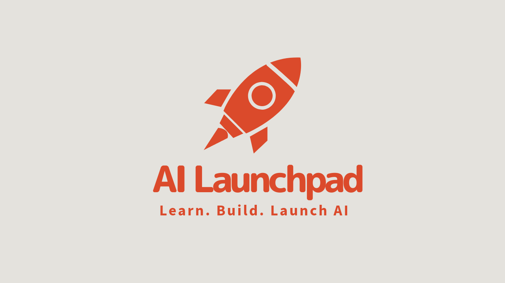

# The AI Launchpad



This repo contains tutorials, code templates, and examples to help you build AI applications. Whether you're just learning or you have AI agents in production, I want to bring you as much value as possible. So please, open issues, leave me comments, and share your feedback.

> Note: I'm rapidly iterating on this repo so things will be broken and incomplete at times.

The AI Launchpad is a community for AI builders, entrepreneurs, and business leaders who want to learn, build, and solve real problems with AI. Get help, resources, connect with other builders, and accelerate your AI journey. 🚀

Sign up for the [**AI Launchpad**](https://kenneth-liao.kit.com/join) waitlist and get access to the Discord server (live now!).

## About Me 👋🏼

Hi! I'm Kenny, a Data Analytics Manager, AI Architect, and founder of the AI Launchpad. I also have a [YouTube channel](https://www.youtube.com/@KennethLiao) where **I teach you how to build AI solutions that solve real problems**.

---

## Getting Started

1. **Install Dependencies**

    I recommend uv to manage python projects.

    For MacOS it's easiest to install with homebrew:

    ```bash
    brew install uv
    ```

    For MacOS and Linux you can also run the following curl command:

    ```bash
    curl -LsSf https://astral.sh/uv/install.sh | sh
    ```

    For Windows or additional information, see the uv [documentation](https://docs.astral.sh/uv/getting-started/installation/).

2. **Clone the Repository and Navigate to the Project Directory**

    ```bash
    git clone https://github.com/kenneth-liao/ai-launchpad.git
    cd ai-launchpad
    ```

3. **Create a Virtual Environment and Install Dependencies**

    ```bash
    uv sync
    ```

    This also installs the ai_launchpad project in editable mode so any changes to the codebase will be immediately reflected.

4. **Copy the .env.example file to .env and add your API keys**

    The repo is organized into several modules. Each module will have its own `.env.example` corresponding to the required API keys for that module. Copy the `.env.example` file to `.env` and add your API keys.

    If on MacOS or Linux you can run the following command:

    ```bash
    cp .env.example .env
    ```

    **Langgraph module**

    For the Langgraph module you need the following keys:
    - [OPENAI_API_KEY](https://platform.openai.com/account/api-keys) (required)
    - [TAVILY_API_KEY](https://tavily.com/) (required)
    - [LANGSMITH_API_KEY](https://smith.langchain.com/) (optional)

    We use OpenAI as the LLM provider and Tavily as the search engine. I also highly recommend getting a free Langsmith API key for observability which is critical for debugging and optimizing AI applications.

    The project also has the Anthropic (langchain_anthropic) and Ollama (langchain_ollama) langchain integrations installed so you can easily switch to Anthropic or Ollama models if you prefer.

5. **Run the Code!**

    **This project uses ipykernel for interactive development!**

    I like it because you can...
    - Highlight blocks of code in any python file and run it in an interactive python window.
    - It's easy to experiment with code and see how each component works.

    Many of the example python files are written not as complete scripts, but rather as interactive files that you can run line by line. If you do run these files as scripts, you will see all of the outputs at once which may not be useful.

    Filenames that start with a number are meant to be run in interactive mode. Highlight the lines of code you want to run and press `shift+enter` to run them.

## Current Projects

As I release new tutorials and code templates, I'll add them here so make sure to follow the repo for updates!

At some point I'll also be migrating past projects from my Youtube channel to this repo.

### [Langgraph Module](ai_launchpad/langgraph_module/README.md)

1. [Building Effective Agents (langgraph_module/effective_agents)](ai_launchpad/langgraph_module/effective_agents/README.md)
2. [Frontends for Langgraph Agents (langgraph_module/frontends)](ai_launchpad/langgraph_module/frontends/README.md)
3. [Langgraph Server (langgraph_module/langgraph_server)](ai_launchpad/langgraph_module/langgraph_server/README.md)
