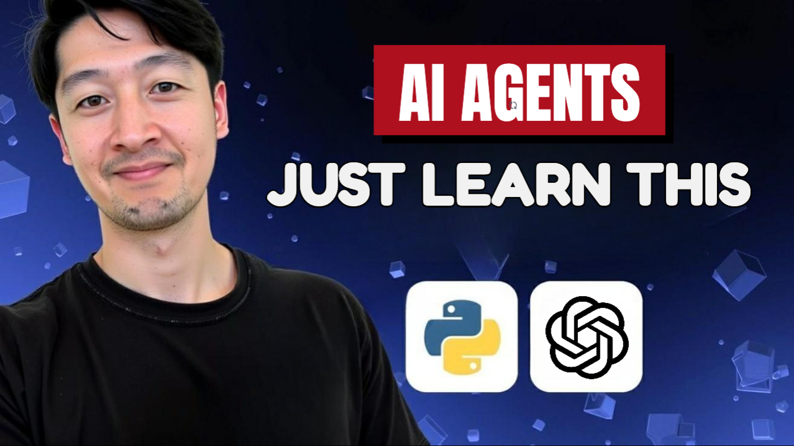

# Agent From Scratch

In this tutorial, you will learn how to build your first AI agent from scratch in Python. By building an AI agent from scratch, you will learn the core design patterns and mechanics of AI agents. This will give you a strong foundation to build more complex and powerful agents and AI applications.

## Video

## Getting Started

1. If you haven't already, install the project by following the `Getting Started` instructions in the project root [README](../../../README.md).

2. Once the `ai-launchpad` project is installed, navigate to the `ai_launchpad/agents_module/agent_from_scratch` directory and start running the code in any file.

    - Any python file that begins with a number (e.g. 1_file.py) is meant to be run in interactive mode. Highlight the lines of code you want to run and press `shift+enter` to run them. Running the file as a script will produce all of the outputs at once which may not be helpful.

## Concepts

1. [LLMs](1_llms.py)
    - Make basic API calls to LLM providers.
    - Get structured outputs from LLMs.
    - Stream responses from the LLM.

2. [Tools](2_tool_calling.py)
    - How to use OpenAI's built-in tools.
    - 5-step process to implement custom tools from scratch with any API.

3. [Retrieval](3_retrieval.py)
    - Implement retrieval on a vector database using ChromaDB.

4. [Long-term Memory](4_long_term_memory.py)
    - Long-term memory enables agents to remember important context across different conversations and sessions.
    - Given an LLM the ability to remember important information about the user.

5. [Short-term Memory](5_short_term_memory.py)
    - Short-term memory can be thought of as the working memory of an agent within a single conversation.

6. [Agent](6_agent.py)
    - Put everything together to build a full customer service agent.
    - The agent can search the web, product and FAQ databases, and manage its own memories to deliver a highly personalized experience to the customer.
    - Understand the agent loop, a core design pattern for agents. It's what gives the agent "agency", or the ability to decide what to do next.

## Resources

- [OpenAI API - Docs](https://platform.openai.com/docs/api-reference/introduction)
- [OpenAI API - Function Calling](https://platform.openai.com/docs/guides/function-calling/function-calling-behavior#page-top)
- [ChromaDB Docs](https://docs.trychroma.com/docs/overview/getting-started)
- [Tavily Docs](https://docs.tavily.com/sdk/python/quick-start)
- [Anthropic - Building Effective Agents](https://www.anthropic.com/engineering/building-effective-agents)
